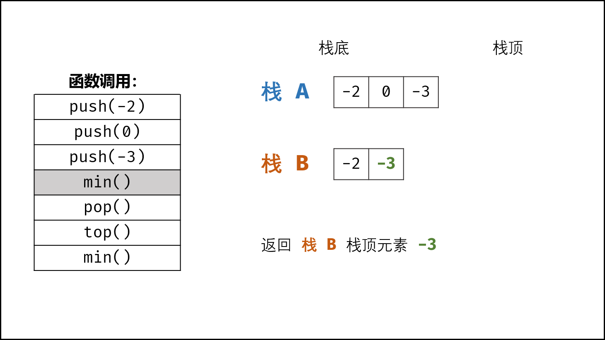

# 剑指 Offer

//D:\workspace\workspace2021\leecode\images


[TOC]


## 09. 用两个栈实现队列


```java

class CQueue {

    //可以使用 双端队列
    Stack<Integer> stack1 = new Stack<>();
    Stack<Integer> stack2 = new Stack<>();

    public CQueue() {

    }

    public void appendTail(int value) {

        while (!stack1.isEmpty()){
            stack2.push(stack1.pop());
        }

        stack1.push(value);

        while (!stack2.isEmpty()){
            stack1.add(stack2.pop());
        }

    }

    public int deleteHead() {

        if(stack1.isEmpty()){
            return -1;
        }else {
            return stack1.pop();
        }
    }
}


```

## 30. 包含min函数的栈



```java

class MinStack {

    Stack<Integer> dataStack;
    Stack<Integer> minStack;


    /** initialize your data structure here. */
    public MinStack() {
        dataStack = new Stack<>();
        minStack = new Stack<>();
    }

    public void push(int x) {

        dataStack.push(x);
        if(minStack.isEmpty() || minStack.peek() >= x){
            minStack.push(x);
        }

    }

    public void pop() {

        Integer popValue = dataStack.pop();
        // Integer是对象不能  minStack.peek() == popValue 这样
        if(minStack.peek().equals(popValue)){
            minStack.pop();
        }

    }

    public int top() {
        if (dataStack.isEmpty()){
            return -1;
        }
        return dataStack.peek();
    }

    public int min() {
        if(minStack.isEmpty()){
            return -1;
        }
        return minStack.peek();
    }
}

```

##  10- I. 斐波那契数列

```java
https://leetcode-cn.com/problems/fei-bo-na-qi-shu-lie-lcof/
```


##  03. 数组中重复的数字

```java

public int findRepeatNumber(int[] nums) {

    int[] arr = new int[100001];

    int len = nums.length;

    for (int i = 0; i < len; i++) {
        int count = arr[nums[i]];
        if (count >= 1) {
            return nums[i];
        }
        arr[nums[i]] = count + 1;

    }

    return Integer.MIN_VALUE;

}
```

## 04. 二维数组中的查找

```java
public boolean findNumberIn2DArray(int[][] matrix, int target) {


    /*
        二分 右上到左下
            大 向下
            小 向左
     */
    if (matrix == null || matrix.length == 0) return false;

    int row = matrix.length;
    int column = matrix[0].length;

    int x = 0, y = column - 1;

    while (x < row && y >= 0) {

        if (target > matrix[x][y]) {
            x += 1;
        } else if (target < matrix[x][y]) {
            y -= 1;
        } else {
            return true;
        }

    }

    return false;
}

```

## 11. 旋转数组的最小数字

```java
public int minArray(int[] numbers) {

    /*
        1.数组是有序的
        2.发生了旋转
        3. i -> j 上
            如果 arr[i] < arr[j] 则 i->j 上必然是递增的
            ** 只能判断从 左 到 右 这部分
            只能判断 mid -> R 是 递增的并不能确定 mid 处是不是最小值
     */
    if (numbers == null || numbers.length == 0) return Integer.MIN_VALUE;

    int len = numbers.length;

    int L = 0, R = len-1;

    while (L < R){

        int mid = L + ((R-L)/2);

        if(numbers[mid] < numbers[R]){
            R = mid;
        }else if(numbers[mid] > numbers[R]){
            L = mid + 1;
        }else {
            R--;
        }

    }

    return numbers[L];
}

```

## 12. 矩阵中的路径

```java

    //https://leetcode-cn.com/problems/ju-zhen-zhong-de-lu-jing-lcof/

    public boolean exist(char[][] board, String word) {

        for (int i = 0; i < board.length; i++) {
            for (int j = 0; j < board[i].length; j++) {

                if(board[i][j] == word.charAt(0) && process(board,word,i,j,0)){
                    return true;
                }

            }
        }

        return false;

    }


    public boolean process(char[][] arr,String world,int x,int y,int k){

        if(!inArea(arr,x,y)) return false;
        if(arr[x][y] != world.charAt(k)) return false;
        if(k == world.length()-1) return true;

        arr[x][y] = ' ';

        boolean res = process(arr,world,x-1,y,k+1)
                || process(arr, world, x+1, y, k+1)
                || process(arr, world, x, y-1, k+1)
                || process(arr, world, x, y+1, k+1);

        arr[x][y] = world.charAt(k);

        return res;


    }

    public boolean inArea(char[][] arr,int x,int y){
        return x>=0 && x < arr.length && y >=0 && y < arr[0].length;
    }


```

## 05. 替换空格
```java
//https://leetcode-cn.com/problems/ti-huan-kong-ge-lcof/
public String replaceSpace(String s) {

    int len = s.length();
    char[] arr = new char[3 * len];
    int size = 0;

    for (int i = 0; i < len; i++) {

        if(s.charAt(i) == ' '){
            arr[size++] = '%';
            arr[size++] = '2';
            arr[size++] = '0';
        }else{
            arr[size++] = s.charAt(i);
        }

    }

    return new String(arr,0,size);

}
```

## 58 - II. 左旋转字符串

https://leetcode-cn.com/problems/zuo-xuan-zhuan-zi-fu-chuan-lcof/

```java
    public String reverseLeftWords(String s, int n) {

        int len = s.length();
        StringBuffer bufferStr = new StringBuffer(s);
        bufferStr = reverse(bufferStr, 0, len - 1);
        bufferStr = reverse(bufferStr, 0, len - 1-n);
        bufferStr = reverse(bufferStr, len-n, len - 1);

        return bufferStr.toString();

    }


    public StringBuffer reverse(StringBuffer str,int s,int e){

        while (s < e){
            char c = str.charAt(s);
            str.replace(s,s+1,str.charAt(e)+"");
            str.replace(e,e+1,c+"");
            s++;
            e--;
        }

        return str;

      //  if (s == null || s.length() == 0 || n < 0) return null;
//
//        n = n %s.length();
//        String substring = s.substring(0, n);
//
//        return s.substring(n) + substring;

    }


```

## 46. 把数字翻译成字符串

```java
//https://leetcode-cn.com/problems/ba-shu-zi-fan-yi-cheng-zi-fu-chuan-lcof/
public int translateNum(int num) {

    String res = String.valueOf(num);

//        int a = 1, b =1;
//
//        for (int i = 2; i <= res.length(); i++) {
//
//            String tmp = res.substring(i-2,i);
//            int c = tmp.compareTo("10")>=0 && tmp.compareTo("25")<=0 ? a + b : b;
//
//            a = b;
//            b = c;
//
//        }
//        return b;

    int len = res.length();

    int[] dp = new int[len+1];
    dp[0] = 1;

    for (int i = 1; i <= len ; i++) {
        dp[i] = dp[i-1]; //第一个
        if(i > 1){
            int t = (res.charAt(i-2) - '0') * 10 + res.charAt(i-1) - '0';
            if(t >= 10 && t <= 25){
                dp[i]+=dp[i-2];
            }
        }
    }

    return dp[len];

}

```

## 48. 最长不含重复字符的子字符串
```java
//https://leetcode-cn.com/problems/zui-chang-bu-han-zhong-fu-zi-fu-de-zi-zi-fu-chuan-lcof/
public int lengthOfLongestSubstring(String s) {

    if(s == null || s.length() == 0) return 0;

    int len = s.length();
    if(len == 1) return 1;
    int L = 0,R = -1;

    HashSet<Character> set = new HashSet<>();
    int max = 0;

    while (++R  < len){
        char c = s.charAt(R);
        while (set.contains(c)){
            max = Math.max(max,set.size());
            set.remove(s.charAt(L));
            L++;
        }

        set.add(c);

    }

    return max < set.size() ? set.size() : max;
}


```

## 18. 删除链表的节点
```java
//https://leetcode-cn.com/problems/shan-chu-lian-biao-de-jie-dian-lcof/
public ListNode deleteNode(ListNode head, int val) {

    if(head.val == val){
        return head.next;
    }

    ListNode curr = head;

    while (curr != null){
        if(curr.next != null && curr.next.val == val){
            curr.next = curr.next.next;
            break;
        }
        curr = curr.next;

    }


    return head;


}

```

## 22. 链表中倒数第k个节点
```java
//https://leetcode-cn.com/problems/lian-biao-zhong-dao-shu-di-kge-jie-dian-lcof/
    public ListNode getKthFromEnd(ListNode head, int k) {

        ListNode S = head, F = head;

//        while (F != null && k > 0){
//            F = F.next;
//            k--;
//        }
//
//        while (F != null){
//            F = F.next;
//            S = S.next;
//        }

//        return S;
        
        while (F != null){

            if(k > 0){
                k--;
            }else {
                S = S.next;
            }
            F = F.next;

        }

        return S;
        
    }

```

##  25. 合并两个排序的链表

````java
//https://leetcode-cn.com/problems/he-bing-liang-ge-pai-xu-de-lian-biao-lcof/
 public ListNode mergeTwoLists(ListNode l1, ListNode l2) {
//
//        if(l1 == null || l2 == null){
//            return l1 != null ? l1 : l2;
//        }
//
//        if(l1.val < l2.val){
//            l1.next = mergeTwoLists(l1.next,l2);
//            return l1;
//        }else {
//            l2.next = mergeTwoLists(l1,l2.next);
//            return l2;
//        }
//

        ListNode head = new ListNode(-1);

        ListNode one = l1,two = l2,curr = head;

        while (one != null && two != null){
            if(one.val < two.val){
                curr.next = one;
                one = one.next;
            }else {
                curr.next = two;
                two = two.next;
            }
            curr = curr.next;
        }
        
        curr.next = one != null ? one : two;

        return head.next;


    }
````

##  52. 两个链表的第一个公共节点

https://leetcode-cn.com/problems/liang-ge-lian-biao-de-di-yi-ge-gong-gong-jie-dian-lcof/

```java
    public ListNode getIntersectionNode(ListNode headA, ListNode headB) {

//        HashSet<ListNode> set = new HashSet<>();
//
//        ListNode curr = headA;
//
//        while (curr != null){
//            set.add(curr);
//            curr = curr.next;
//        }
//
//        curr = headB;
//
//        while (curr != null){
//            if(set.contains(curr)){
//                return curr;
//            }
//            curr = curr.next;
//        }
//
//        return null;


        if(headA == null || headB == null) return null;

        ListNode pA = headA,pB = headB;

        while (pA != pB){

           pA = pA == null ? headB : pA.next;
           pB = pB == null ? headA : pB.next;


        }

        return pA;

    }

```


##  53 - I. 在排序数组中查找数字 I

```java
//https://leetcode-cn.com/problems/zai-pai-xu-shu-zu-zhong-cha-zhao-shu-zi-lcof/
//二分

public int search(int[] nums, int target) {

    if(nums == null || nums.length == 0) return -1;
    int len = nums.length;
    if(nums[0] > target || nums[len-1] < target) return -1;


    int L = 0,R = len -1;
    int count = 0;
    while (L <= R){

        int mid = L + ((R-L) >> 1);

        if(nums[mid] > target){
            R = mid - 1;
        }else if(nums[mid] < target){
            L = mid + 1;
        }else {
            int i = mid-1;
            while (mid <= R && nums[mid] == target){
                count+=1;
                mid++;
            }
            while (i >= L && nums[i] == target ){
                count+=1;
                i--;
            }
            break;
        }


    }


    return count;

}
```

##  53 - II. 0～n-1中缺失的数字

```java
//https://leetcode-cn.com/problems/que-shi-de-shu-zi-lcof/
public int missingNumber(int[] nums) {

    int L = 0,R = nums.length-1;

    while (L <= R){
        int mid = L + ((R - L) >> 1);
        if(nums[mid] == mid){
            L = mid + 1;
        }else {
            R = mid -1;
        }
    }

    return L;


}
```

## 26. 树的子结构

```java
//https://leetcode-cn.com/problems/shu-de-zi-jie-gou-lcof/
//https://leetcode-cn.com/problems/shu-de-zi-jie-gou-lcof/solution/yi-pian-wen-zhang-dai-ni-chi-tou-dui-che-uhgs/
public boolean isSubStructure(TreeNode A, TreeNode B) {


    if(A == null || B == null) return false;

    return isSub(A, B) || isSubStructure(A.left,B) || isSubStructure(A.right, B);


}

public boolean isSub(TreeNode A,TreeNode B){

    if(B == null) return true;

    if(A == null || A.val != B.val) return false;


    return isSub(A.left,B.left) && isSub(A.right,B.right);

}

```

## 27. 二叉树的镜像
```java
//https://leetcode-cn.com/problems/er-cha-shu-de-jing-xiang-lcof/
    public TreeNode mirrorTree(TreeNode root) {

        preOrder(root);

        return root;

    }


    public void preOrder(TreeNode root){

        if(root == null) return;

        TreeNode tmp = root.left;
        root.left = root.right;
        root.right = tmp;

        if(root.left != null) preOrder(root.left);

        if(root.right != null) preOrder(root.right);


    }

```

##  28. 对称的二叉树

```java
//https://leetcode-cn.com/problems/dui-cheng-de-er-cha-shu-lcof/
public boolean isSymmetric(TreeNode root) {

    if(root == null) return true;

    return isSym(root.left,root.right);

}

public boolean isSym(TreeNode L,TreeNode R){

    if(L == null && R == null) return true;

    if(L == null || R == null || L.val != R.val) return false;

    return isSym(L.left, R.right) && isSym(L.right, R.left);

}


```

##  42. 连续子数组的最大和
```java
//https://leetcode-cn.com/problems/lian-xu-zi-shu-zu-de-zui-da-he-lcof/
    public int maxSubArray(int[] nums) {

        if (nums == null || nums.length == 0) return 0;

        int len = nums.length;
//        int[] dp = new int[len];
//        dp[0] = nums[0];
//        int max = dp[0];
//        for (int i = 1; i < len; i++) {
//            int tmp = dp[i - 1] + nums[i];
//            dp[i] = Math.max(tmp, nums[i]);
//            max = Math.max(dp[i], max);
//        }
//
//
//        return max;


        int max = nums[0];

        for (int i = 1; i < len; i++) {
            nums[i] = nums[i-1] > 0 ? nums[i-1] + nums[i] : nums[i];
            max = Math.max(nums[i],max);
        }

        return max;

    }


```

## 13. 机器人的运动范围

https://leetcode-cn.com/problems/ji-qi-ren-de-yun-dong-fan-wei-lcof/

```java

// dfs
boolean[][] visited;
int m, n, k;

public int movingCount(int m, int n, int k) {

    this.m = m;
    this.n = n;
    this.k = k;
    visited = new boolean[m][n];

    return dfs(0, 0);

}

public int dfs(int x, int y) {

    if (!isValid(x, y) || (get(x) + get(y)) > k || visited[x][y]) return 0;

    visited[x][y] = true;

    return 1 + dfs(x + 1, y) + dfs(x, y + 1);

}

public int get(int x) {
    int res = 0;
    while (x != 0) {
        res = res + x % 10;
        x = x / 10;
    }
    return res;
}

public boolean isValid(int x, int y) {
    return x >= 0 && x < m && y >= 0 && y < n;
}


//bfs
public int movingCount(int m, int n, int k) {

    boolean[][] visited = new boolean[m][n];
    int res = 0;

    Queue<int[]> queue = new LinkedList<>();
    //x y
    queue.add(new int[]{0,0});

    while (!queue.isEmpty()){

        int[] arr = queue.poll();
        int x = arr[0],y = arr[1];

        if(x>=m || y >= n || visited[x][y] || (get(x) + get(y)) > k) continue;

        visited[x][y] = true;
        res++;

        queue.add(new int[]{x+1,y});
        queue.add(new int[]{x,y+1});

    }

    return res;

}

public int get(int a){
    int res = 0;
    while (a != 0){
        res = res + a % 10;
        a = a / 10;
    }
    return res;
}


```


## 07. 重建二叉树

https://leetcode-cn.com/problems/zhong-jian-er-cha-shu-lcof/

```java

Map<Integer,Integer> map = new HashMap<>();
public TreeNode buildTree(int[] preorder, int[] inorder) {

    for (int i = 0; i < inorder.length; i++) {
        map.put(inorder[i],i);
    }

    return build(preorder,0,preorder.length-1,inorder,0,inorder.length-1);

}

public TreeNode build(int[] preorder,int pL,int pR,
                      int[] inorder,int iL,int iR){

    if(pL > pR || iL > iR) return null;

    int headVal = preorder[pL];
    TreeNode head = new TreeNode(headVal);

    int pivot = map.get(headVal);

    head.left = build(preorder,pL+1,pivot-iL+pL,inorder,iL,pivot-1);
    head.right = build(preorder,pivot-iL+pL+1,pR,inorder,pivot+1,iR);

    return head;

}

```

## 14- I. 剪绳子

https://leetcode-cn.com/problems/jian-sheng-zi-lcof/

```java
public int cuttingRope(int n) {

    /*
        我们想要求长度为n的绳子剪掉后的最大乘积，可以从前面比n小的绳子转移而来
        用一个dp数组记录从0到n长度的绳子剪掉后的最大乘积，也就是dp[i]表示长度为i的绳子剪成m段后的最大乘积，初始化dp[2] = 1
        我们先把绳子剪掉第一段（长度为j），如果只剪掉长度为1，对最后的乘积无任何增益，所以从长度为2开始剪
        剪了第一段后，剩下(i - j)长度可以剪也可以不剪。如果不剪的话长度乘积即为j * (i - j)；如果剪的话长度乘积即为j * dp[i - j]。取两者最大值max(j * (i - j), j * dp[i - j])
        第一段长度j可以取的区间为[2,i)，对所有j不同的情况取最大值，因此最终dp[i]的转移方程为
        dp[i] = max(dp[i], max(j * (i - j), j * dp[i - j]))
        最后返回dp[n]即可

     */
//        int[] dp = new int[n + 1];
//        dp[2] = 1;
//        for (int i = 3; i < n + 1; i++) {
//            for (int j = 2; j < i; j++) {
//                dp[i] = Math.max(dp[i], Math.max(j * (i - j), j * dp[i - j]));
//            }
//        }
//        return dp[n];

    //https://leetcode-cn.com/problems/jian-sheng-zi-lcof/solution/mian-shi-ti-14-i-jian-sheng-zi-tan-xin-si-xiang-by/
    if (n < 4) return n - 1;
    int res = 1;
    while (n > 4) {
        res *= 3;
        n -= 3;
    }
    return res * n;


}
```

##  14-II. 剪绳子 II

https://leetcode-cn.com/problems/jian-sheng-zi-ii-lcof/

```java
    public int cuttingRope(int n) {

        int MOD = 1000000007;

//        if(n < 4) return n-1;
//
//        long res = 1;
//
//        while (n > 4){
//
//            res = res * 3 % MOD;
//            n = n - 3;
//
//        }
//
//        return (int) (res*n%MOD);


        if(n < 4) return n-1;

        BigInteger[] dp = new BigInteger[n +1];
        Arrays.fill(dp,BigInteger.valueOf(1));
        dp[2] = BigInteger.valueOf(2);

        for (int i = 3; i < n + 1; i++) {
            for (int j = 2; j < i ; j++) {
                dp[i] = dp[i].max(BigInteger.valueOf(j * (i-j)).max(BigInteger.valueOf(j).multiply(dp[i-j])));
            }
        }

        return dp[n].mod(BigInteger.valueOf(MOD)).intValue();

    }
```

## 21. 调整数组顺序使奇数位于偶数前面

https://leetcode-cn.com/problems/diao-zheng-shu-zu-shun-xu-shi-qi-shu-wei-yu-ou-shu-qian-mian-lcof/

```java
    public int[] exchange(int[] nums) {

        if (nums == null || nums.length == 0) return nums;

//        Deque<Integer> queue = new LinkedList<>();
//
//        for (int i = 0; i < nums.length; i++) {
//            if (nums[i] % 2 == 0) {
//                queue.addLast(nums[i]);
//            } else {
//                queue.addFirst(nums[i]);
//            }
//        }
//
//        int index = 0;
//
//        while (!queue.isEmpty()) {
//            nums[index++] = queue.pollFirst();
//        }

        int len = nums.length;
        int L = 0,R = -1;

        while (++R < len){

            if(nums[R] % 2 == 1) {
                swap(nums, L, R);
                L++;
            }
        }

        return nums;

    }


    public void swap(int[] arr,int L,int R){
        if(L != R){
            arr[L] = arr[L] ^ arr[R];
            arr[R] = arr[L] ^ arr[R];
            arr[L] = arr[L] ^ arr[R];
        }
    }

```

##  57. 和为s的两个数字

https://leetcode-cn.com/problems/he-wei-sde-liang-ge-shu-zi-lcof/

```java
    public int[] twoSum(int[] nums, int target) {

//        HashSet<Integer> set = new HashSet<>();
//
//        for (int i = 0; i < nums.length; i++) {
//            int tmp = target - nums[i];
//            if(set.contains(tmp)){
//                return new int[]{tmp,nums[i]};
//            }
//            set.add(nums[i]);
//        }


        int L = 0,R = nums.length -1;

        while (L < R){

            int tmp = nums[L] + nums[R];

            if(tmp > target){
                R--;
            }else if(tmp < target) {
                L++;
            }else {
                return new int[]{nums[L],nums[R]};
            }

        }

        return new int[0];


    }
```

## 58 - I. 翻转单词顺序

https://leetcode-cn.com/problems/fan-zhuan-dan-ci-shun-xu-lcof/

```java
    public String reverseWords(String s) {

        s = s.trim();

        int i = s.length() - 1,j = i;
        StringBuilder builder = new StringBuilder();

        while (i >= 0){

            while (i >= 0 && s.charAt(i) != ' ') i--;
            builder.append(s.substring(i+1,j+1)).append(" ");

            while (i>=0 && s.charAt(i) == ' ') i--;
            j=i;

        }

        return builder.toString().trim();


    }
```

## 34. 二叉树中和为某一值的路径

https://leetcode-cn.com/problems/er-cha-shu-zhong-he-wei-mou-yi-zhi-de-lu-jing-lcof/

```java
    List<List<Integer>> list = new ArrayList<>();
    Deque<Integer> path = new LinkedList<>();

    public List<List<Integer>> pathSum(TreeNode root, int target) {

        dfs(root,target);
        return list;
    }


    public void dfs(TreeNode root,int target){

        if(root == null) return;

        path.addLast(root.val);
        target-=root.val;
        if (root.left == null && root.right == null && target == 0){
            list.add(new LinkedList<>(path));
        }
        dfs(root.left,target);
        dfs(root.right,target);
        path.pollLast();

    }
    
//=======================================================
    
List<List<Integer>> list = new LinkedList<>();
    Map<TreeNode,TreeNode> map = new HashMap<>();

    public List<List<Integer>> pathSum(TreeNode root, int target) {

        if (root == null) return list;
        
        Queue<TreeNode> queueNode = new LinkedList<>();
        Queue<Integer> queueSum = new LinkedList<>();
        
        queueNode.offer(root);
        queueSum.offer(0);
        
        while (!queueNode.isEmpty()){

            TreeNode node = queueNode.poll();
            
            int res = queueSum.poll() + node.val;
            
            if(node.left == null && node.right == null){
                if(res == target){
                    getPath(node);
                }
            }else {
                if(node.left != null){
                    map.put(node.left,node);
                    queueNode.offer(node.left);
                    queueSum.offer(res);
                }
                
                if(node.right != null){
                    map.put(node.right,node);
                    queueNode.offer(node.right);
                    queueSum.offer(res);
                }
            }
        }

        return list;

    }

    private void getPath(TreeNode node) {
        List<Integer> tmp = new LinkedList<>();
        while (node != null){
            tmp.add(node.val);
            node = map.get(node);
        }
        Collections.reverse(tmp);
        list.add(tmp);
    }

```

##  36. 二叉搜索树与双向链表

https://leetcode-cn.com/problems/er-cha-sou-suo-shu-yu-shuang-xiang-lian-biao-lcof/

```java
    Node pre,head;
    public Node treeToDoublyList(Node root) {

        if(root == null) return null;
        dfs(root);

        head.left = pre;
        pre.right = head;

        return head;

    }

    public void dfs(Node curr){

        if(curr == null) return;

        dfs(curr.left);

        //code
        if(pre != null) pre.right = curr;
        else head = curr;

        curr.left = pre;
        pre = curr;

        dfs(curr.right);

    }

//=====================================
class Node {
    public int val;
    public Node left;
    public Node right;

    public Node() {}

    public Node(int _val) {
        val = _val;
    }

    public Node(int _val,Node _left,Node _right) {
        val = _val;
        left = _left;
        right = _right;
    }
}


```

##  54. 二叉搜索树的第k大节点

https://leetcode-cn.com/problems/er-cha-sou-suo-shu-de-di-kda-jie-dian-lcof/

```java
    int res,k;
    public int kthLargest(TreeNode root, int k) {
        this.k = k;
        dfs(root);
        return res;

    }

    public void dfs(TreeNode curr){

      if(curr == null) return;

      dfs(curr.right);

      if(k == 0) return;
      if(--k == 0) res = curr.val;


      dfs(curr.left);


    }
```

## 45. 把数组排成最小的数

https://leetcode-cn.com/problems/ba-shu-zu-pai-cheng-zui-xiao-de-shu-lcof/

```java
    public String minNumber(int[] nums) {

        int len = nums.length;
        String[] arr = new String[len];

        for (int i = 0; i < len; i++) {
            arr[i] = String.valueOf(nums[i]);
        }

        sort(arr, 0, len - 1);

        StringBuilder res = new StringBuilder();

        for (String s : arr) {
            res.append(s);
        }
        return res.toString();
    }


    public void sort(String[] arr, int left, int right) {

        if (left < right) {

            int random = left + (int) (Math.random() * (right - left + 1));

            swap(arr, random, right);


            int[] p = process(arr, left, right);

            sort(arr, left, p[0] - 1);
            sort(arr, p[1] + 1, right);


        }

    }

    private int[] process(String[] arr, int left, int right) {

        int L = left - 1, R = right;

        while (left < R) {

            if ((arr[left] + arr[right]).compareTo(arr[right] + arr[left]) < 0) {
                swap(arr, ++L, left++);
            } else if ((arr[left] + arr[right]).compareTo(arr[right] + arr[left]) > 0) {
                swap(arr, left, --R);
            } else {
                left++;
            }

        }

        swap(arr, R, right);

        return new int[]{L + 1, R};
    }

    public void swap(String[] arr, int a, int b) {
        if (a != b) {
            String tmp = arr[a];
            arr[a] = arr[b];
            arr[b] = tmp;
        }
    }


```

##  61. 扑克牌中的顺子

https://leetcode-cn.com/problems/bu-ke-pai-zhong-de-shun-zi-lcof/

```java
    public boolean isStraight(int[] nums) {


        HashSet<Integer> set = new HashSet<>();

        int max = 0,min = 14;

        for (int i = 0; i < nums.length; i++) {
            if(nums[i] == 0) continue;

            min = Math.min(min,nums[i]);
            max = Math.max(max,nums[i]);

            if(set.contains(nums[i])) return false;

            set.add(nums[i]);

        }

        return max - min < 5;


    }


```

##  40. 最小的k个数

https://leetcode-cn.com/problems/zui-xiao-de-kge-shu-lcof/

```java
    public int[] getLeastNumbers(int[] arr, int k) {

        int[] res = new int[k];

        if(k == 0) return res;

        //大根堆
        PriorityQueue<Integer> queue = new PriorityQueue<>(new Comparator<Integer>() {
            @Override
            public int compare(Integer o1, Integer o2) {
                return o2-o1;
            }
        });

        for (int i = 0; i < k; i++) {
            queue.add(arr[i]);
        }


        for (int i = k; i < arr.length; i++) {

            if(arr[i] < queue.peek()){
                queue.poll();
                queue.add(arr[i]);
            }
        }

        for (int i = 0; i < k; i++) {
            res[i] = queue.poll();
        }


        return res;

    }
```

##  41. 数据流中的中位数

https://leetcode-cn.com/problems/shu-ju-liu-zhong-de-zhong-wei-shu-lcof/

```java

class MedianFinder {

    // 小顶堆，保存较大的一半
    PriorityQueue<Integer> minHeap;
    // 大顶堆，保存较小的一半
    PriorityQueue<Integer> maxHeap;

    /**
     * initialize your data structure here.
     */
    public MedianFinder() {
        minHeap = new PriorityQueue<>(new Comparator<Integer>() {
            @Override
            public int compare(Integer o1, Integer o2) {
                //小顶堆
                return o1 - o2;
            }
        });
        maxHeap = new PriorityQueue<>(new Comparator<Integer>() {
            @Override
            public int compare(Integer o1, Integer o2) {
                //大顶堆
                return o2 - o1;
            }
        });
    }

    public void addNum(int num) {

        if(minHeap.size() != maxHeap.size()){
            minHeap.add(num);
            maxHeap.add(minHeap.poll());
        }else{
            maxHeap.add(num);
            minHeap.add(maxHeap.poll());
        }


    }

    public double findMedian() {
        return minHeap.size() != maxHeap.size() ? minHeap.peek() : (minHeap.peek()+ maxHeap.peek())/2.0;
    }
}

```

## 20. 表示数值的字符串

https://leetcode-cn.com/problems/biao-shi-shu-zhi-de-zi-fu-chuan-lcof/

```java
  public boolean isNumber(String s) {
        /*
            【.】 之前不能有 【.】【e】
            【e】 之前不能有 【e】 e的前后必须有数字
            【+-】 第一个位置或e后的第一个位置
            
         */


        if (s == null || s.length() == 0) return false;

        boolean num = false, dot = false, e = false;

        char[] charArray = s.trim().toCharArray();

        for (int i = 0; i < charArray.length; i++) {
            
            if(charArray[i] >= '0' && charArray[i] <= '9'){
                num = true;
            }else if(charArray[i] == '.'){
                // . 之前不能有 . e
                if(dot || e) return false;
                
                dot = true;
                
            }else if(charArray[i] == 'e' || charArray[i] == 'E'){
                // e 之前不能有e 并且前面必须有数字
                if (e || !num) return false;
                
                e = true;
                //123e   123e+
                num = false;
                
            }else if(charArray[i] == '+' || charArray[i] == '-'){
                // +- 只能在第一个位置或者 e 的后面
                if(i != 0 && charArray[i-1] != 'e'  && charArray[i-1] != 'E' ) return false;
            }else {
                return false;
            }
            
        }
        
        return num;

    }
```

## 55 - I. 二叉树的深度

https://leetcode-cn.com/problems/er-cha-shu-de-shen-du-lcof/

```java

    public int maxDepth(TreeNode root) {

//        return dfs(root);
        return bfs(root);
    }


    public int dfs(TreeNode head){

        if(head == null) return 0;

        int leftDeep = 1 + dfs(head.left);
        int rightDeep = 1 + dfs(head.right);

        return 1 + Math.max(leftDeep,rightDeep);

    }

    public int bfs(TreeNode head){

        if(head == null) return 0;
        Queue<TreeNode> queue = new LinkedList<>();
        queue.add(head);
        int deep = 0;

        while (!queue.isEmpty()){

            int size = queue.size();
            for (int i = 0; i < size; i++) {
                TreeNode node = queue.poll();
                if(node.left != null) queue.add(node.left);
                if(node.right != null) queue.add(node.right);
            }

            deep+=1;

        }
        return deep;
    }

```

## 55 - II. 平衡二叉树

https://leetcode-cn.com/problems/ping-heng-er-cha-shu-lcof/

```java

    class BalancedTree{
        boolean isBalanced;
        int height;
        public BalancedTree(boolean isBalanced,int height){
            this.isBalanced = isBalanced;
            this.height = height;
        }
    }

    public boolean isBalanced(TreeNode root) {

        return process(root).isBalanced;

    }

    public BalancedTree process(TreeNode head){


        if(head == null) return new BalancedTree(true,0);

        BalancedTree leftTree = process(head.left);
        BalancedTree rightTree = process(head.right);

        int height = Math.max(leftTree.height, rightTree.height) + 1;

        boolean isBalance = true;
        if(!leftTree.isBalanced || !rightTree.isBalanced || Math.abs(leftTree.height- rightTree.height) > 1){
            isBalance = false;
        }

        return new BalancedTree(isBalance,height);

    }
//====================================================================


    public boolean isBalanced(TreeNode root) {
        
        return process(root) != -1;
        
    }

    
    public int process(TreeNode head){
        
        if(head == null) return 0;
        
        int left = process(head.left);
        if(left == -1) return -1;

        int right = process(head.right);
        if(right == -1) return -1;
        
        return Math.abs(left-right) < 2 ? Math.max(left,right)+1 : -1;

    }
    
```

##  68 - I. 二叉搜索树的最近公共祖先

https://leetcode-cn.com/problems/er-cha-sou-suo-shu-de-zui-jin-gong-gong-zu-xian-lcof/

```java

    HashMap<TreeNode,TreeNode> map = new HashMap<>();

    public TreeNode lowestCommonAncestor(TreeNode root, TreeNode p, TreeNode q) {

        map.put(root,root);
        preOrder(root);

        HashSet<TreeNode> set = new HashSet<>();
        TreeNode curr = p;
        while (curr != map.get(curr)){
            set.add(curr);
            curr = map.get(curr);
        }
        set.add(curr);

        curr  = q;
        while (!set.contains(curr)){
            curr = map.get(curr);
        }

        return curr;

    }

    public void preOrder(TreeNode head){

        if(head == null) return;

        map.put(head.left,head);
        map.put(head.right, head);

        preOrder(head.left);
        preOrder(head.right);


    }
//========================================================================
    
    public TreeNode lowestCommonAncestor(TreeNode root, TreeNode p, TreeNode q){

        if(root == null || p == root || q == root) return root;

        TreeNode left = lowestCommonAncestor(root.left,p,q);
        TreeNode right = lowestCommonAncestor(root.right,p,q);

        if(left != null && right != null){
            return root;
        }

        return left != null ? left : right;

    }

```

## 16. 数值的整数次方

https://leetcode-cn.com/problems/shu-zhi-de-zheng-shu-ci-fang-lcof/

```java
    public double myPow(double x, int n) {

        if(x == 0) return 0;
        if(n == 0) return 1;

        long b = n;
        double res = 1.0;

        if(b < 0){
            x  = 1/x;
            b = -b;
        }

        while (b > 0){
            if((b&1) == 1) {
                res *= x;
            }
            x *=x;
            b >>= 1;
        }

        return res;


    }

```

## 33. 二叉搜索树的后序遍历序列

https://leetcode-cn.com/problems/er-cha-sou-suo-shu-de-hou-xu-bian-li-xu-lie-lcof/

```java
 public boolean verifyPostorder(int[] postorder) {

        //根节点 > 所有左节点
        //根节点 < 所有右节点

//        return process(postorder,0,postorder.length-1);


        Stack<Integer> stack = new Stack<>();
        int root = Integer.MAX_VALUE;

        for (int i = postorder.length-1; i >=0; i--) {

            if(postorder[i] > root) return false;

            while (!stack.isEmpty() && stack.peek() > postorder[i]){
                root = stack.pop();
            }

            stack.add(postorder[i]);

        }

        return true;


    }


    public boolean process(int[] arr,int L,int R){

        if(L >= R) return true;

        int p = L;
        while (arr[p] < arr[R]) p++;

        int m = p;
        while (arr[p] < arr[R]) p++;

        return p == R && process(arr,L,m-1) && process(arr, m,R-1);

    }

```

## 15. 二进制中1的个数

https://leetcode-cn.com/problems/er-jin-zhi-zhong-1de-ge-shu-lcof/

```java
    public int hammingWeight(int n) {

        int count = 0;

        /*
        String binaryString = Integer.toBinaryString(n);
        for (int i = 0; i < binaryString.length(); i++) {
            if (binaryString.charAt(i) == '1') count += 1;
        }
        */

        /*
        for (int i = 0; i < 32; i++) {
            if ((n & (i << i)) != 0) {
                count++;
            }
        }
        */

        while (n != 0){
            n = n & n-1;
            count++;
        }


        return count;
    }


```

##  65. 不用加减乘除做加法

https://leetcode-cn.com/problems/bu-yong-jia-jian-cheng-chu-zuo-jia-fa-lcof/

```java
    public int add(int a, int b) {

        while (b != 0){

            int c = (a & b) << 1;
            a = a ^ b;
            b = c;

        }

        return a;

    }
```

## 56 - I. 数组中数字出现的次数

https://leetcode-cn.com/problems/shu-zu-zhong-shu-zi-chu-xian-de-ci-shu-lcof/

```java
    public int[] singleNumbers(int[] nums) {

        int tmp = 0;

        for (int num : nums) {
            tmp = tmp ^ num;
        }

        //此时 tmp = a ^ b
        //且 tmp != 0
        //说明 tmp 的二进制数中必定至少有一位为1

        //去出做左边的1
        int rightOne = tmp & (~tmp + 1);

        int onlyOne = 0;
        for (int num : nums) {
            if ((num & rightOne) == 0) {
                onlyOne = onlyOne ^ num;
            }
        }


        return new int[]{onlyOne, tmp ^ onlyOne};

    }

```

##  56 - II. 数组中数字出现的次数 II

https://leetcode-cn.com/problems/shu-zu-zhong-shu-zi-chu-xian-de-ci-shu-ii-lcof/

```java
    public int singleNumber(int[] nums) {

        int one = 0,two = 0;

        for (int num : nums) {
            one = one ^ num & ~two;
            two = two ^ num & ~one;
        }

        return one;
    }
```

##  39. 数组中出现次数超过一半的数字

https://leetcode-cn.com/problems/shu-zu-zhong-chu-xian-ci-shu-chao-guo-yi-ban-de-shu-zi-lcof/

```java
    public int majorityElement(int[] nums) {

        /*
        Map<Integer,Integer> map = new HashMap<>();
        for (int num : nums) {
            map.put(num,map.getOrDefault(num,0) + 1);
        }

        Map.Entry<Integer, Integer> res = null;
        for (Map.Entry<Integer, Integer> entry : map.entrySet()) {

            if(res == null || res.getValue() < entry.getValue()){
                res = entry;
            }
            
        }
        return res.getKey();
        */
        
        

        int x = 0,votes = 0;

        for (int i = 0; i < nums.length; i++) {

            if(votes == 0) x = nums[i];

            votes = votes + (x == nums[i] ? 1 : -1);

        }

        return x;

    }


```

## 66. 构建乘积数组

https://leetcode-cn.com/problems/gou-jian-cheng-ji-shu-zu-lcof/

```java
    public int[] constructArr(int[] a) {

        int len = a.length;
        if(len == 0) return new int[0];

        int[] res = new int[len];
        res[0] = 1;
        int tmp = 1;

        for (int i = 1; i < len; i++) {
            res[i] = res[i-1] * a[i-1];
        }

        for (int i = len - 2; i >=0 ; i--) {
            tmp = tmp * a[i+1];
            res[i] = tmp * res[i];
        }

        return res;


    }
```

## 57 - II. 和为s的连续正数序列

https://leetcode-cn.com/problems/he-wei-sde-lian-xu-zheng-shu-xu-lie-lcof/

```java
    public int[][] findContinuousSequence(int target) {


        int i = 1,j = 1,sum = 0;

        List<int[]> res = new ArrayList<>();

        while (i <= target /2){

            if(sum < target){
                sum+=j;
                j++;
            }else if(sum > target) {
                sum-=i;
                i++;
            }else {
                int[] arr = new int[j-i];
                for (int k = i; k < j; k++) {
                    arr[k-i] = k;
                }
                res.add(arr);
                sum-=i;
                i++;
            }

        }

        return res.toArray(new int[res.size()][]);

    }


```

## 62. 圆圈中最后剩下的数字

https://leetcode-cn.com/problems/yuan-quan-zhong-zui-hou-sheng-xia-de-shu-zi-lcof/

```java
    public int lastRemaining(int n, int m) {

/*        ArrayList<Integer> list = new ArrayList<>();
        for (int i = 0; i < n; i++) {
            list.add(i);
        }

        int idx = 0;

        while (n > 1){
            idx = (idx + m - 1) % n;
            list.remove(idx);
            n--;
        }

        return list.get(0);*/

        int idx  = 0;
        for (int i = 2; i <= n ; i++) {
            idx = (idx + m) % i;
        }

        return idx;

    }


```

##  29. 顺时针打印矩阵

https://leetcode-cn.com/problems/shun-shi-zhen-da-yin-ju-zhen-lcof/

```java

    public int[] spiralOrder(int[][] matrix) {

        if(matrix == null || matrix.length == 0) return new int[0];

        int left = 0,top = 0,right = matrix[0].length-1,bottom = matrix.length-1;
//        int[] arr = new int[(right+1) * (bottom+1)];
        int index = 0;

        List<Integer> list = new ArrayList<>();

////        while (right >= left && top <= bottom){
//        while (top <= bottom && right >= left){
//
//
//            //→
//            for (int i = left; i <= right; i++) {
////                arr[index++] = matrix[top][i];
//                list.add(matrix[top][i]);
//            }
//            top++;
//
//            //↓
//            for (int i = top; i <= bottom ; i++) {
////                arr[index++] = matrix[i][right];
//                list.add(matrix[i][right]);
//            }
//            right--;
//
//            //←
//            for (int i = right; i >=left ; i--) {
////                arr[index++] = matrix[bottom][i];
//                list.add(matrix[bottom][i]);
//            }
//            bottom--;
//
//            //↑
//            for (int i = bottom; i >=top ; i--) {
////                arr[index++] = matrix[i][left];
//                list.add(matrix[i][left]);
//            }
//            left++;
//
//        }
        while (top <= bottom && left <= right){

            //上 →
            for (int i = left; i <= right ; i++) {
                list.add(matrix[top][i]);
            }
            top+=1;
            //右 ↓
            for (int i = top; i <= bottom ; i++) {
                list.add(matrix[i][right]);
            }
            right-=1;

            if(!(left <= right && top <= bottom)) break;

            //下 ←
            for (int i = right; i >= left ; i--) {
                list.add(matrix[bottom][i]);
            }
            bottom-=1;

            //左 ↑
            for (int i = bottom; i >= top; i--) {
                list.add(matrix[i][left]);
            }
            left+=1;
        }


        int[] arr = new int[list.size()];

        for (int i = 0; i < list.size(); i++) {
            arr[i] = list.get(i);
        }

        return arr;

    }

```

##  31. 栈的压入、弹出序列

https://leetcode-cn.com/problems/zhan-de-ya-ru-dan-chu-xu-lie-lcof/

```java
    public boolean validateStackSequences(int[] pushed, int[] popped) {


        if(popped.length != popped.length) return false;
        if(popped.length == 0) return true;

        int index = 0;

        Stack<Integer> stack = new Stack<>();

        for (int i = 0; i < pushed.length; i++) {

            stack.push(pushed[i]);

            while (!stack.isEmpty() && stack.peek() == popped[index]){
                stack.pop();
                index+=1;
            }

        }


        return index == popped.length && stack.isEmpty();


    }


```

##  67. 把字符串转换成整数

https://leetcode-cn.com/problems/ba-zi-fu-chuan-zhuan-huan-cheng-zheng-shu-lcof/

```java
  public int strToInt(String str) {

        //去掉前后的空格
        str = str.trim();

        //如果为空，直接返回0
        if(str.length() == 0) return 0;

        //sign 符号，1是正数，-1是负数，默认为正数
        int index = 0,res = 0,sign = 1,len = str.length();

        if(str.charAt(index) == '-' || str.charAt(index) == '+')
            sign = str.charAt(index++) == '+' ? 1: -1;

        for(;index < len;index++){

            int digit = str.charAt(index) - '0';

            if(digit < 0 | digit > 9) break;

            if(res > Integer.MAX_VALUE/10 || (res == Integer.MAX_VALUE/10 && digit > Integer.MAX_VALUE%10)){
                return sign == 1 ? Integer.MAX_VALUE : Integer.MIN_VALUE;
            }else {
                res = res * 10 + digit;
            }

        }

        return sign * res;

    }

```


