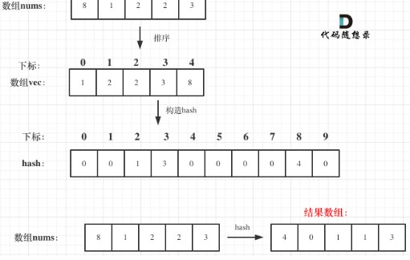
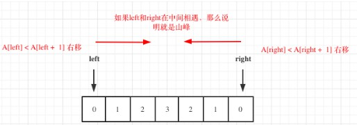

## 数组

[TOC]


// D:\workspace\workspace2021\leecode

### 1365. 有多少小于当前数字的数字



```java

/*
        1365. 有多少小于当前数字的数字
        https://leetcode-cn.com/problems/how-many-numbers-are-smaller-than-the-current-number/submissions/
 */
 */

public int[] smallerNumbersThanCurrent(int[] nums) {

    Map<Integer,Integer> map = new HashMap<>();

    int len = nums.length;
    int[] res = Arrays.copyOf(nums,len);
    Arrays.sort(res);

    for (int i = 0; i < len; i++) {
        if(!map.containsKey(res[i])){
            map.put(res[i],i);
        }
    }

    for (int i = 0; i < len; i++) {
        res[i] = map.get(nums[i]);
    }

    return res;


}

```

### 941. 有效的山脉数组


```java

/*
        941. 有效的山脉数组
        https://leetcode-cn.com/problems/valid-mountain-array/submissions/
 */


public boolean validMountainArray(int[] arr) {

    if(arr == null || arr.length < 3) return false;

    int len = arr.length;

    int L = 0,R = len-1;

    while (L < len - 1 && arr[L] < arr[L+1]){
        L++;
    }

    while (R > 0 && arr[R] < arr[R-1]){
        R--;
    }

    if(L == R && L > 0 && R < len - 1){
        return true;
    }

    return false;

}

```


### 1207. 独一无二的出现次数

```java

/*
        1207. 独一无二的出现次数
        https://leetcode-cn.com/problems/unique-number-of-occurrences/submissions/
 */

public boolean uniqueOccurrences(int[] arr) {

    if(arr == null || arr.length <= 1) return true;

    Map<Integer,Integer> map = new HashMap<>();
    for (int elem : arr) {
        map.put(elem,map.getOrDefault(elem,0) + 1);
    }

    HashSet<Integer> set = new HashSet<>();
    for (Map.Entry<Integer, Integer> entry : map.entrySet()) {
        set.add(entry.getValue());
    }

    return set.size() == map.size();

}

```

### 704. 二分查找

```java

/*
        https://leetcode-cn.com/problems/binary-search/
        704. 二分查找
 */
public int search(int[] nums, int target) {
    int len = nums.length;
    if(target < nums[0] || target > nums[len-1]) return -1;

    int L = 0,R = len -1;

    while (L <= R){

    int mid = L + ((R-L)>>1);

    if(nums[mid] == target){
    return mid;
    }else if(nums[mid] > target){
    R = mid - 1;
    }else {
    L = mid + 1;
    }

    }

    return -1;

    }
```


### 27. 移除元素


```java

/*
        27. 移除元素
        https://leetcode-cn.com/problems/remove-element/
 */

public int removeElement(int[] nums, int val) {

    int S = 0,E = 0;
    int len = nums.length;

    while (E < len ){

    if(nums[E] != val){
    nums[S++] = nums[E];
    }
    E++;
    }

    return S+1;

    }

```

### 977. 有序数组的平方

```java

/*
        双指针
        977. 有序数组的平方
        https://leetcode-cn.com/problems/squares-of-a-sorted-array/

 */

public int[] sortedSquares(int[] nums) {

    if (nums == null || nums.length == 0) return nums;

        int len = nums.length;
        int[] res = new int[len];
    
        int L = 0,R = len-1;
        int index = len-1;
    
        while (L <= R){
    
        if(nums[L] * nums[L] > nums[R] * nums[R]){
            res[index--] = nums[L] * nums[L];
            L++;
        }else {
        res[index--] = nums[R] * nums[R];
        R--;
    }


    }


    return res;

}

```

###  209. 长度最小的子数组


```java

/*
        
        滑动窗口
        209. 长度最小的子数组
        https://leetcode-cn.com/problems/minimum-size-subarray-sum/
 */

public int minSubArrayLen(int target, int[] nums) {

    int len = nums.length;

    int minRes = Integer.MAX_VALUE;
    int L = 0,R = -1,sum = 0;
    
    while (++R < len){
        
        sum+=nums[R];
        
        while (sum >= target){
            minRes = Math.min(minRes,R-L+1);
            sum-=nums[L++];
        }
        
        
    }
    return minRes == Integer.MAX_VALUE ? 0 : minRes;

}
```

### 59. 螺旋矩阵 II

```java

/*
        59. 螺旋矩阵 II
        https://leetcode-cn.com/problems/spiral-matrix-ii/
 */
public int[][] generateMatrix(int n) {

    if (n < 1) return null;

    int[][] resArr = new int[n][n];

    int top = 0, bottom = n - 1, left = 0, right = n - 1;
    int count = 1;
    int loop = (n + 1) >> 1;

    while (loop-- > 0){

        //上 →
        for (int i = left; i <=right; i++) {
            resArr[top][i] = count;
            count+=1;
        }
        top+=1;

        //右 ↓
        for (int i = top; i <= bottom ; i++) {
            resArr[i][right] = count;
            count+=1;
        }
        right-=1;

        //下 ←
        for (int i = right; i >= left ; i--) {
            resArr[bottom][i] = count;
            count+=1;
        }
        bottom-=1;

        //左 ↑
        for (int i = bottom; i >= top ; i--) {
            resArr[i][left] = count;
            count+=1;
        }
        left+=1;

    }

    return resArr;


}

```

### 54. 螺旋矩阵

```java

/*
        https://leetcode-cn.com/problems/spiral-matrix/
        54. 螺旋矩阵
 */
public List<Integer> spiralOrder(int[][] matrix) {

    List<Integer> list = new ArrayList<>();

    int x = matrix.length;
    int y = matrix[0].length;

    int top = 0, bottom = x - 1, left = 0, right = y - 1;
    int loop = (y+1) >> 1;

    while (top <= bottom && left <= right){

        //上 →
        for (int i = left; i <= right ; i++) {
            list.add(matrix[top][i]);
        }
        top+=1;
        //右 ↓
        for (int i = top; i <= bottom ; i++) {
            list.add(matrix[i][right]);
        }
        right-=1;

        if(!(left <= right && top <= bottom)) break;

        //下 ←
        for (int i = right; i >= left ; i--) {
            list.add(matrix[bottom][i]);
        }
        bottom-=1;

        //左 ↑
        for (int i = bottom; i >= top; i--) {
            list.add(matrix[i][left]);
        }
        left+=1;
    }

    return list;

}
```


